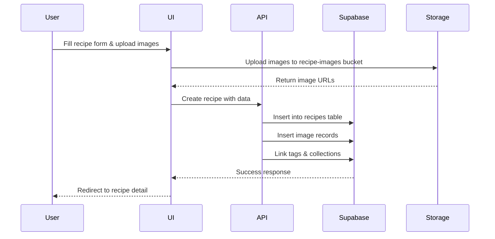
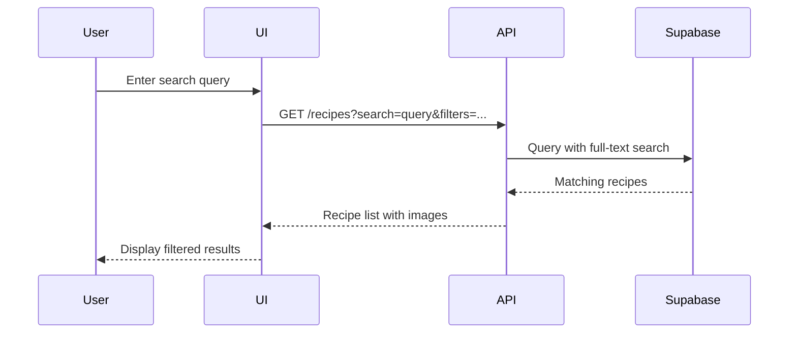

# Cookbook App - Architecture Plan

## Overview

A modern Next.js web application with Supabase backend for tracking and managing recipes with images, tags, categories, and collections.

## Tech Stack

### Frontend

- **Next.js 15** with App Router
- **TypeScript** for type safety
- **Tailwind CSS** for styling
- **shadcn/ui** for UI components
- **React Hook Form** for form management
- **Zod** for schema validation
- **Lucide React** for icons

### Backend

- **Supabase** (PostgreSQL database)
- **Supabase Auth** for authentication
- **Supabase Storage** for image uploads
- **Supabase Realtime** (optional for future features)

## Database Schema

### Tables

#### 1. `profiles` (extends Supabase auth.users)

```sql
CREATE TABLE profiles (
  id UUID REFERENCES auth.users(id) PRIMARY KEY,
  email TEXT,
  full_name TEXT,
  avatar_url TEXT,
  created_at TIMESTAMP WITH TIME ZONE DEFAULT NOW(),
  updated_at TIMESTAMP WITH TIME ZONE DEFAULT NOW()
);
```

#### 2. `recipes`

```sql
CREATE TABLE recipes (
  id UUID DEFAULT gen_random_uuid() PRIMARY KEY,
  user_id UUID REFERENCES profiles(id) ON DELETE CASCADE NOT NULL,
  title TEXT NOT NULL,
  description TEXT,
  ingredients TEXT[] NOT NULL, -- Array of ingredients
  instructions TEXT NOT NULL,
  cooking_time INTEGER, -- in minutes
  created_at TIMESTAMP WITH TIME ZONE DEFAULT NOW(),
  updated_at TIMESTAMP WITH TIME ZONE DEFAULT NOW()
);

-- Indexes for search
CREATE INDEX idx_recipes_user_id ON recipes(user_id);
CREATE INDEX idx_recipes_title ON recipes USING GIN(to_tsvector('english', title));
CREATE INDEX idx_recipes_ingredients ON recipes USING GIN(ingredients);
```

#### 3. `recipe_images`

```sql
CREATE TABLE recipe_images (
  id UUID DEFAULT gen_random_uuid() PRIMARY KEY,
  recipe_id UUID REFERENCES recipes(id) ON DELETE CASCADE NOT NULL,
  image_url TEXT NOT NULL,
  storage_path TEXT NOT NULL,
  display_order INTEGER DEFAULT 0,
  created_at TIMESTAMP WITH TIME ZONE DEFAULT NOW()
);

CREATE INDEX idx_recipe_images_recipe_id ON recipe_images(recipe_id);
```

#### 4. `categories`

```sql
CREATE TABLE categories (
  id UUID DEFAULT gen_random_uuid() PRIMARY KEY,
  user_id UUID REFERENCES profiles(id) ON DELETE CASCADE NOT NULL,
  name TEXT NOT NULL UNIQUE,
  color TEXT DEFAULT '#6366f1',
  created_at TIMESTAMP WITH TIME ZONE DEFAULT NOW()
);

CREATE INDEX idx_categories_user_id ON categories(user_id);
```

#### 5. `collections`

```sql
CREATE TABLE collections (
  id UUID DEFAULT gen_random_uuid() PRIMARY KEY,
  user_id UUID REFERENCES profiles(id) ON DELETE CASCADE NOT NULL,
  name TEXT NOT NULL,
  description TEXT,
  created_at TIMESTAMP WITH TIME ZONE DEFAULT NOW(),
  updated_at TIMESTAMP WITH TIME ZONE DEFAULT NOW()
);

CREATE INDEX idx_collections_user_id ON collections(user_id);
```

#### 6. `recipe_collections` (Many-to-Many)

```sql
CREATE TABLE recipe_collections (
  id UUID DEFAULT gen_random_uuid() PRIMARY KEY,
  recipe_id UUID REFERENCES recipes(id) ON DELETE CASCADE NOT NULL,
  collection_id UUID REFERENCES collections(id) ON DELETE CASCADE NOT NULL,
  added_at TIMESTAMP WITH TIME ZONE DEFAULT NOW(),
  UNIQUE(recipe_id, collection_id)
);

CREATE INDEX idx_recipe_collections_recipe_id ON recipe_collections(recipe_id);
CREATE INDEX idx_recipe_collections_collection_id ON recipe_collections(collection_id);
```

#### 7. `tags`

```sql
CREATE TABLE tags (
  id UUID DEFAULT gen_random_uuid() PRIMARY KEY,
  user_id UUID REFERENCES profiles(id) ON DELETE CASCADE NOT NULL,
  name TEXT NOT NULL UNIQUE,
  color TEXT DEFAULT '#10b981',
  created_at TIMESTAMP WITH TIME ZONE DEFAULT NOW()
);

CREATE INDEX idx_tags_user_id ON tags(user_id);
```

#### 8. `recipe_tags` (Many-to-Many)

```sql
CREATE TABLE recipe_tags (
  id UUID DEFAULT gen_random_uuid() PRIMARY KEY,
  recipe_id UUID REFERENCES recipes(id) ON DELETE CASCADE NOT NULL,
  tag_id UUID REFERENCES tags(id) ON DELETE CASCADE NOT NULL,
  UNIQUE(recipe_id, tag_id)
);

CREATE INDEX idx_recipe_tags_recipe_id ON recipe_tags(recipe_id);
CREATE INDEX idx_recipe_tags_tag_id ON recipe_tags(tag_id);
```

## Row Level Security (RLS) Policies

### profiles

```sql
ALTER TABLE profiles ENABLE ROW LEVEL SECURITY;

CREATE POLICY "Users can view all profiles"
  ON profiles FOR SELECT
  USING (true);

CREATE POLICY "Users can update own profile"
  ON profiles FOR UPDATE
  USING (auth.uid() = id);
```

### recipes

```sql
ALTER TABLE recipes ENABLE ROW LEVEL SECURITY;

CREATE POLICY "Users can view own recipes"
  ON recipes FOR SELECT
  USING (auth.uid() = user_id);

CREATE POLICY "Users can insert own recipes"
  ON recipes FOR INSERT
  WITH CHECK (auth.uid() = user_id);

CREATE POLICY "Users can update own recipes"
  ON recipes FOR UPDATE
  USING (auth.uid() = user_id);

CREATE POLICY "Users can delete own recipes"
  ON recipes FOR DELETE
  USING (auth.uid() = user_id);
```

### recipe_images

```sql
ALTER TABLE recipe_images ENABLE ROW LEVEL SECURITY;

CREATE POLICY "Users can view images of own recipes"
  ON recipe_images FOR SELECT
  USING (
    EXISTS (
      SELECT 1 FROM recipes
      WHERE recipes.id = recipe_images.recipe_id
      AND recipes.user_id = auth.uid()
    )
  );

CREATE POLICY "Users can insert images to own recipes"
  ON recipe_images FOR INSERT
  WITH CHECK (
    EXISTS (
      SELECT 1 FROM recipes
      WHERE recipes.id = recipe_images.recipe_id
      AND recipes.user_id = auth.uid()
    )
  );

CREATE POLICY "Users can delete images of own recipes"
  ON recipe_images FOR DELETE
  USING (
    EXISTS (
      SELECT 1 FROM recipes
      WHERE recipes.id = recipe_images.recipe_id
      AND recipes.user_id = auth.uid()
    )
  );
```

### categories, collections, tags

```sql
-- Similar RLS policies for user-owned resources
ALTER TABLE categories ENABLE ROW LEVEL SECURITY;
ALTER TABLE collections ENABLE ROW LEVEL SECURITY;
ALTER TABLE tags ENABLE ROW LEVEL SECURITY;

CREATE POLICY "Users can view own categories"
  ON categories FOR SELECT
  USING (auth.uid() = user_id);

CREATE POLICY "Users can manage own categories"
  ON categories FOR ALL
  USING (auth.uid() = user_id)
  WITH CHECK (auth.uid() = user_id);

-- Repeat similar policies for collections and tags
```

### recipe_collections, recipe_tags

```sql
ALTER TABLE recipe_collections ENABLE ROW LEVEL SECURITY;
ALTER TABLE recipe_tags ENABLE ROW LEVEL SECURITY;

CREATE POLICY "Users can manage recipe_collections"
  ON recipe_collections FOR ALL
  USING (
    EXISTS (
      SELECT 1 FROM recipes
      WHERE recipes.id = recipe_collections.recipe_id
      AND recipes.user_id = auth.uid()
    )
  )
  WITH CHECK (
    EXISTS (
      SELECT 1 FROM recipes
      WHERE recipes.id = recipe_collections.recipe_id
      AND recipes.user_id = auth.uid()
    )
  );

-- Repeat similar policies for recipe_tags
```

## Storage Buckets

### `recipe-images`

```sql
INSERT INTO storage.buckets (id, name, public)
VALUES ('recipe-images', 'recipe-images', true);

-- RLS for storage
CREATE POLICY "Users can upload images to own recipes"
  ON storage.objects FOR INSERT
  WITH CHECK (
    bucket_id = 'recipe-images'
    AND auth.role() = 'authenticated'
  );

CREATE POLICY "Users can view own recipe images"
  ON storage.objects FOR SELECT
  USING (
    bucket_id = 'recipe-images'
    AND auth.role() = 'authenticated'
  );

CREATE POLICY "Users can delete own recipe images"
  ON storage.objects FOR DELETE
  USING (
    bucket_id = 'recipe-images'
    AND auth.role() = 'authenticated'
  );
```

## Application Structure

```
cookbook/
├── app/
│   ├── (auth)/
│   │   ├── login/
│   │   │   └── page.tsx
│   │   ├── signup/
│   │   │   └── page.tsx
│   │   └── layout.tsx
│   ├── (dashboard)/
│   │   ├── recipes/
│   │   │   ├── page.tsx              # Recipe list with search/filter
│   │   │   ├── new/
│   │   │   │   └── page.tsx          # Create recipe form
│   │   │   └── [id]/
│   │   │       └── page.tsx          # Recipe detail view
│   │   ├── categories/
│   │   │   └── page.tsx
│   │   ├── collections/
│   │   │   └── page.tsx
│   │   ├── tags/
│   │   │   └── page.tsx
│   │   ├── profile/
│   │   │   └── page.tsx
│   │   └── layout.tsx
│   ├── api/
│   │   └── [...]/                    # API routes if needed
│   ├── layout.tsx                    # Root layout
│   └── page.tsx                      # Landing page
├── components/
│   ├── ui/                           # shadcn/ui components
│   ├── auth/
│   │   ├── LoginForm.tsx
│   │   └── SignupForm.tsx
│   ├── recipes/
│   │   ├── RecipeCard.tsx
│   │   ├── RecipeForm.tsx
│   │   ├── RecipeDetail.tsx
│   │   ├── ImageUploader.tsx
│   │   └── IngredientInput.tsx
│   ├── layout/
│   │   ├── Header.tsx
│   │   ├── Sidebar.tsx
│   │   └── Navigation.tsx
│   ├── filters/
│   │   ├── SearchBar.tsx
│   │   ├── FilterPanel.tsx
│   │   └── SortDropdown.tsx
│   └── shared/
│       ├── LoadingSpinner.tsx
│       ├── ErrorBoundary.tsx
│       └── EmptyState.tsx
├── lib/
│   ├── supabase/
│   │   ├── client.ts                 # Browser client
│   │   ├── server.ts                 # Server client
│   │   └── middleware.ts             # Auth middleware
│   ├── types/
│   │   ├── recipe.ts
│   │   ├── category.ts
│   │   ├── collection.ts
│   │   └── tag.ts
│   ├── utils/
│   │   ├── validation.ts             # Zod schemas
│   │   └── helpers.ts
│   └── hooks/
│       ├── useRecipes.ts
│       ├── useCategories.ts
│       ├── useCollections.ts
│       └── useTags.ts
├── public/
│   └── images/
└── .env.local                        # Environment variables
```

## Key Features Implementation

### 1. Authentication Flow

- Supabase Auth for user signup/login
- Protected routes using middleware
- Session management with cookies
- Password reset functionality

### 2. Recipe Management

- **Create/Edit**: Form with title, description, ingredients (dynamic list), instructions, cooking time
- **Image Upload**: Drag-and-drop or click-to-upload, unlimited images per recipe
- **View**: Full recipe detail with all images in a gallery
- **Delete**: Cascade delete of associated images, tags, and collection memberships

### 3. Search & Filter

- **Search**: Full-text search on recipe title and ingredients (PostgreSQL GIN indexes)
- **Filter by Tags**: Multi-select tag filter
- **Filter by Categories**: Category dropdown filter
- **Filter by Collections**: Collection dropdown filter
- **Sort**: Date added (newest/oldest), Alphabetical (A-Z/Z-A)

### 4. Categories & Collections

- **Categories**: Pre-defined or user-created categories for organizing recipes
- **Collections**: User-created custom collections (like "Weeknight Dinners", "Family Favorites")
- **Assignment**: Recipes can belong to one category and multiple collections

### 5. Tagging System

- User-created tags for flexible organization
- Tags can be applied to multiple recipes
- Tag colors for visual distinction

## Data Flow Diagrams

### Recipe Creation Flow



### Search Flow



## Environment Variables

```env
# Supabase
NEXT_PUBLIC_SUPABASE_URL=your_supabase_project_url
NEXT_PUBLIC_SUPABASE_ANON_KEY=your_supabase_anon_key
SUPABASE_SERVICE_ROLE_KEY=your_service_role_key

# App
NEXT_PUBLIC_APP_URL=http://localhost:3000
```

## Performance Considerations

1. **Database Indexes**: GIN indexes for full-text search, B-tree indexes for foreign keys
2. **Image Optimization**: Use Supabase image transformations for thumbnails
3. **Pagination**: Implement pagination for recipe lists (20 items per page)
4. **Caching**: Use React Query or SWR for client-side caching
5. **Lazy Loading**: Load images on scroll for better performance

## Security Considerations

1. **RLS Policies**: All tables have row-level security enabled
2. **Input Validation**: Zod schemas for all form inputs
3. **XSS Protection**: React's built-in XSS protection
4. **CSRF Protection**: Supabase handles CSRF tokens
5. **File Upload Validation**: Validate file types and sizes on both client and server

## Future Enhancements

1. **Recipe Sharing**: Share recipes with other users
2. **Import/Export**: Import recipes from URLs or export to PDF
3. **Meal Planning**: Add recipes to weekly meal plans
4. **Shopping Lists**: Generate shopping lists from ingredients
5. **Nutritional Info**: Add and display nutritional data
6. **Ratings & Reviews**: Rate and review recipes
7. **Real-time Sync**: Collaborative editing with Supabase Realtime
