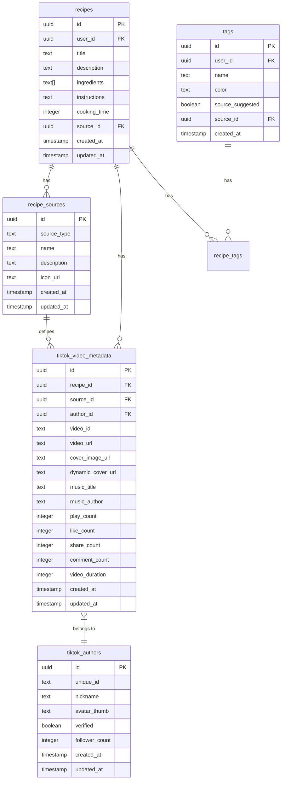
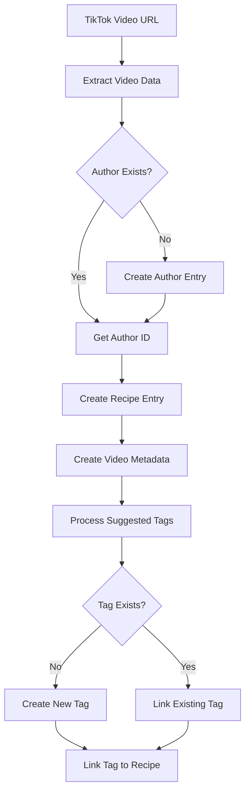

# TikTok Recipe Import - Design Decisions

## Executive Summary

This document provides a comprehensive explanation of the design decisions made for the TikTok recipe import feature. The schema is designed to be robust, extensible, and maintainable while supporting the immediate requirements and future growth.

## Table of Contents

1. [Core Design Principles](#core-design-principles)
2. [Architecture Overview](#architecture-overview)
3. [Detailed Design Decisions](#detailed-design-decisions)
4. [Trade-offs and Alternatives](#trade-offs-and-alternatives)
5. [Performance Considerations](#performance-considerations)
6. [Security Considerations](#security-considerations)
7. [Future Extensibility](#future-extensibility)
8. [Implementation Guidelines](#implementation-guidelines)

---

## Core Design Principles

### 1. **Separation of Concerns**

Each table has a single, well-defined responsibility:

- [`recipes`](plans/database-schema.md:32) - Core recipe data
- [`recipe_sources`](plans/tiktok-import-migrations.md:8) - Source tracking
- [`tiktok_authors`](plans/tiktok-import-migrations.md:36) - Author information
- [`tiktok_video_metadata`](plans/tiktok-import-migrations.md:48) - Video-specific data

### 2. **Data Normalization**

Author and source data are normalized to avoid duplication:

- Authors are stored once and referenced multiple times
- Sources are centralized for easy management
- Reduces data redundancy and improves consistency

### 3. **Extensibility**

The schema is designed to accommodate future platforms:

- Generic `recipe_sources` table can support any platform
- Platform-specific tables follow consistent patterns
- Easy to add Instagram, YouTube, or other sources

### 4. **Backward Compatibility**

Existing recipes remain unaffected:

- New columns are nullable
- Existing data is preserved
- No breaking changes to current functionality

### 5. **Performance Optimization**

Strategic indexing ensures fast queries:

- Foreign keys are indexed
- Search fields have appropriate indexes
- Composite indexes for common query patterns

---

## Architecture Overview

### Entity Relationship Diagram



### Data Flow



---

## Detailed Design Decisions

### Decision 1: Separate `recipe_sources` Table

**Rationale:**

- **Centralized Source Management**: All recipe sources are tracked in one place
- **Easy Analytics**: Can query recipes by source type
- **Future-Proof**: Easy to add new sources without schema changes
- **Consistent Interface**: All sources follow the same pattern

**Alternative Considered:**

- Add `source_type` column directly to [`recipes`](plans/database-schema.md:32)
  - **Rejected**: Would make it harder to add source-specific metadata
  - **Rejected**: No place to store source configuration (name, icon, description)

**Implementation:**

```sql
CREATE TABLE recipe_sources (
  id UUID PRIMARY KEY,
  source_type TEXT UNIQUE, -- 'manual', 'tiktok', 'instagram'
  name TEXT,
  description TEXT,
  icon_url TEXT
);
```

---

### Decision 2: Separate `tiktok_authors` Table

**Rationale:**

- **Data Normalization**: Author data stored once, referenced multiple times
- **Author Analytics**: Can track recipes per author, author popularity
- **Future Features**: Enable "follow author", "view all recipes from author"
- **Data Updates**: Author profile changes propagate to all their recipes

**Alternative Considered:**

- Store author data in [`tiktok_video_metadata`](plans/tiktok-import-migrations.md:48)
  - **Rejected**: Would duplicate author data for each video
  - **Rejected**: No way to track all recipes from the same author
  - **Rejected**: Author updates would require updating multiple rows

**Implementation:**

```sql
CREATE TABLE tiktok_authors (
  id UUID PRIMARY KEY,
  unique_id TEXT UNIQUE, -- @username
  nickname TEXT,
  avatar_thumb TEXT,
  verified BOOLEAN,
  follower_count INTEGER
);
```

---

### Decision 3: Separate `tiktok_video_metadata` Table

**Rationale:**

- **Clean Separation**: Platform-specific data isolated from core recipe data
- **Extensibility**: Easy to add new TikTok fields without touching [`recipes`](plans/database-schema.md:32)
- **Performance**: Video metadata only loaded when needed
- **Data Integrity**: One-to-one relationship ensures each recipe has at most one video

**Alternative Considered:**

- Add TikTok columns directly to [`recipes`](plans/database-schema.md:32)
  - **Rejected**: Would bloat the recipes table with platform-specific data
  - **Rejected**: Not extensible to other platforms
  - **Rejected**: Violates single responsibility principle

**Implementation:**

```sql
CREATE TABLE tiktok_video_metadata (
  id UUID PRIMARY KEY,
  recipe_id UUID REFERENCES recipes(id) ON DELETE CASCADE,
  source_id UUID REFERENCES recipe_sources(id),
  author_id UUID REFERENCES tiktok_authors(id),
  video_id TEXT UNIQUE,
  video_url TEXT,
  cover_image_url TEXT,
  dynamic_cover_url TEXT,
  -- ... additional TikTok fields
  CONSTRAINT tiktok_video_metadata_unique_recipe UNIQUE(recipe_id)
);
```

---

### Decision 4: Minimal Changes to `recipes` Table

**Rationale:**

- **Backward Compatibility**: Existing recipes continue to work
- **Clean Core Schema**: Recipe table focused on recipe data
- **Performance**: Smaller table size for faster queries
- **Simplicity**: Easier to understand and maintain

**Changes Made:**

- Added `source_id` foreign key (nullable)
- Set default source to 'manual' for existing recipes

**Alternative Considered:**

- Add all TikTok fields to [`recipes`](plans/database-schema.md:32)
  - **Rejected**: Would make the table too wide
  - **Rejected**: Many null columns for non-TikTok recipes
  - **Rejected**: Hard to extend to other platforms

---

### Decision 5: Reuse Existing `tags` Table

**Rationale:**

- **Consistency**: All tags use the same system
- **User Control**: Users can convert suggested tags to their own
- **Simplified UI**: Single tag management interface
- **No Duplication**: No need for separate tag systems

**Changes Made:**

- Added `source_suggested` boolean flag
- Added `source_id` foreign key to track which source suggested the tag

**Alternative Considered:**

- Create separate `tiktok_suggested_tags` table
  - **Rejected**: Would require two tag management interfaces
  - **Rejected**: Users couldn't easily convert suggested tags
  - **Rejected**: More complex queries to get all tags

---

### Decision 6: Foreign Key Cascade Behavior

**Rationale:**

- **Data Integrity**: Prevents orphaned records
- **Automatic Cleanup**: No manual cleanup required
- **Predictable Behavior**: Clear rules for what happens on delete

**Cascade Rules:**

- `recipe_id` in [`tiktok_video_metadata`](plans/tiktok-import-migrations.md:48): `CASCADE`
  - When a recipe is deleted, its video metadata is also deleted
- `source_id` in [`recipes`](plans/database-schema.md:32): `SET NULL`
  - When a source is deleted, recipes keep their data but lose source reference
- `author_id` in [`tiktok_video_metadata`](plans/tiktok-import-migrations.md:48): `SET NULL`
  - When an author is deleted, video metadata keeps video data but loses author reference

---

### Decision 7: Row Level Security (RLS) Policies

**Rationale:**

- **Data Security**: Users can only access their own data
- **Multi-Tenancy**: Clear data isolation between users
- **Compliance**: Follows Supabase best practices

**Policy Design:**

- `recipe_sources`: Public read (anyone can view available sources)
- `tiktok_authors`: Public read (anyone can view author information)
- `tiktok_video_metadata`: User-scoped (only recipe owner can access)

---

### Decision 8: Index Strategy

**Rationale:**

- **Query Performance**: Fast lookups on common query patterns
- **Foreign Key Indexes**: All foreign keys are indexed
- **Search Optimization**: Indexes on frequently searched fields

**Indexes Created:**

- [`recipes.source_id`](plans/tiktok-import-migrations.md:25): Filter recipes by source
- [`recipe_sources.source_type`](plans/tiktok-import-migrations.md:26): Quick source lookup
- [`tiktok_authors.unique_id`](plans/tiktok-import-migrations.md:65): Find author by username
- [`tiktok_authors.nickname`](plans/tiktok-import-migrations.md:66): Search authors by name
- [`tiktok_video_metadata.recipe_id`](plans/tiktok-import-migrations.md:67): Join recipes with metadata
- [`tiktok_video_metadata.source_id`](plans/tiktok-import-migrations.md:68): Filter by source
- [`tiktok_video_metadata.author_id`](plans/tiktok-import-migrations.md:69): Get all videos by author
- [`tiktok_video_metadata.video_id`](plans/tiktok-import-migrations.md:70): Find video by TikTok ID
- [`tags.source_suggested`](plans/tiktok-import-migrations.md:78): Filter suggested tags
- [`tags.source_id`](plans/tiktok-import-migrations.md:79): Filter tags by source

---

## Trade-offs and Alternatives

### Trade-off 1: Normalization vs. Query Complexity

**Decision:** Normalize author and source data

**Pros:**

- Data consistency
- Easy updates
- Reduced storage

**Cons:**

- Requires joins for queries
- More complex queries

**Mitigation:**

- Helper functions for common queries
- Views for complex joins
- Proper indexing for performance

---

### Trade-off 2: Extensibility vs. Simplicity

**Decision:** Design for future platforms

**Pros:**

- Easy to add new sources
- Consistent patterns
- Reusable components

**Cons:**

- More tables
- More complex schema
- Over-engineering for current needs

**Mitigation:**

- Clear documentation
- Consistent naming conventions
- Helper functions to abstract complexity

---

### Trade-off 3: Data Completeness vs. Nullability

**Decision:** Make most fields nullable

**Pros:**

- Flexible data import
- Can handle missing data
- Backward compatible

**Cons:**

- More null checks in code
- Potential data quality issues

**Mitigation:**

- Validation in application layer
- Default values where appropriate
- Data quality checks

---

## Performance Considerations

### Query Performance

**Optimized Queries:**

1. Get recipes by source:

```sql
SELECT r.*, tvm.* FROM recipes r
INNER JOIN tiktok_video_metadata tvm ON r.id = tvm.recipe_id
WHERE r.user_id = $1 AND r.source_id = $2
```

- Uses index on [`recipes.source_id`](plans/tiktok-import-migrations.md:25)
- Uses index on [`tiktok_video_metadata.recipe_id`](plans/tiktok-import-migrations.md:67)

2. Get recipes by author:

```sql
SELECT r.*, tvm.* FROM recipes r
INNER JOIN tiktok_video_metadata tvm ON r.id = tvm.recipe_id
WHERE r.user_id = $1 AND tvm.author_id = $2
```

- Uses index on [`tiktok_video_metadata.author_id`](plans/tiktok-import-migrations.md:69)

3. Get author by username:

```sql
SELECT * FROM tiktok_authors WHERE unique_id = $1
```

- Uses unique index on [`tiktok_authors.unique_id`](plans/tiktok-import-migrations.md:65)

### Storage Efficiency

**Strategies:**

- Normalized data reduces duplication
- Nullable fields only consume space when used
- TEXT fields for variable-length data
- Arrays for multi-value fields (ingredients, tags)

### Caching Considerations

**Recommendations:**

- Cache author data (changes infrequently)
- Cache source data (rarely changes)
- Consider caching popular recipe lists
- Use Supabase's built-in caching

---

## Security Considerations

### Data Access Control

**RLS Policies:**

- Users can only access their own recipes
- Author and source data is public read-only
- Video metadata inherits recipe ownership

### SQL Injection Prevention

**Best Practices:**

- Use parameterized queries
- Supabase client handles escaping
- Never concatenate user input into SQL

### Data Validation

**Validation Layers:**

1. Database constraints (NOT NULL, UNIQUE, CHECK)
2. RLS policies (user ownership)
3. Application validation (format, length)
4. Input sanitization

### Privacy Considerations

**User Data:**

- Author data is public (TikTok usernames are public)
- User's recipes are private
- No sensitive data in TikTok metadata

---

## Future Extensibility

### Adding New Social Media Platforms

**Pattern to Follow:**

1. Add source entry to [`recipe_sources`](plans/tiktok-import-migrations.md:8)
2. Create platform-specific tables (e.g., `instagram_authors`, `instagram_post_metadata`)
3. Add helper functions for platform operations
4. Update RLS policies if needed

**Example - Instagram:**

```sql
-- Add Instagram source
INSERT INTO recipe_sources (source_type, name, description)
VALUES ('instagram', 'Instagram', 'Recipes imported from Instagram posts');

-- Create Instagram authors table
CREATE TABLE instagram_authors (
  id UUID PRIMARY KEY,
  username TEXT UNIQUE,
  full_name TEXT,
  profile_picture_url TEXT,
  verified BOOLEAN,
  follower_count INTEGER
);

-- Create Instagram post metadata table
CREATE TABLE instagram_post_metadata (
  id UUID PRIMARY KEY,
  recipe_id UUID REFERENCES recipes(id) ON DELETE CASCADE,
  source_id UUID REFERENCES recipe_sources(id),
  author_id UUID REFERENCES instagram_authors(id),
  post_id TEXT UNIQUE,
  post_url TEXT,
  media_url TEXT,
  caption TEXT,
  like_count INTEGER,
  comment_count INTEGER
);
```

### Future Features Enabled by This Design

1. **Author Following:**

   - Track which authors users follow
   - Show new recipes from followed authors
   - Author profile pages

2. **Source Analytics:**

   - Track recipe popularity by source
   - Identify trending sources
   - Source-specific recommendations

3. **Batch Import:**

   - Import multiple videos from one author
   - Import from hashtag searches
   - Import from trending feeds

4. **Recipe Recommendations:**

   - Suggest recipes based on source
   - Recommend recipes from similar authors
   - Trending recipes from popular sources

5. **Social Features:**
   - Share recipes with source attribution
   - View original TikTok video
   - Link back to author's profile

---

## Implementation Guidelines

### Step 1: Apply Migration

1. Copy the SQL from [`tiktok-import-migrations.md`](plans/tiktok-import-migrations.md)
2. Run in Supabase SQL Editor
3. Verify all tables and indexes are created
4. Test RLS policies

### Step 2: Update TypeScript Types

Create new types in [`src/lib/types/recipe.ts`](src/lib/types/recipe.ts):

```typescript
export interface RecipeSource {
  id: string;
  source_type: string;
  name: string;
  description: string | null;
  icon_url: string | null;
  created_at: string;
  updated_at: string;
}

export interface TikTokAuthor {
  id: string;
  unique_id: string;
  nickname: string | null;
  avatar_thumb: string | null;
  verified: boolean;
  follower_count: number;
  created_at: string;
  updated_at: string;
}

export interface TikTokVideoMetadata {
  id: string;
  recipe_id: string;
  source_id: string;
  author_id: string | null;
  video_id: string;
  video_url: string;
  cover_image_url: string | null;
  dynamic_cover_url: string | null;
  music_title: string | null;
  music_author: string | null;
  play_count: number;
  like_count: number;
  share_count: number;
  comment_count: number;
  video_duration: number | null;
  created_at: string;
  updated_at: string;
}

export interface RecipeWithTikTokMetadata extends Recipe {
  source?: RecipeSource;
  tiktok_metadata?: TikTokVideoMetadata;
  tiktok_author?: TikTokAuthor;
}
```

### Step 3: Create API Functions

Create helper functions in [`src/lib/supabase/tiktok.ts`](src/lib/supabase/tiktok.ts):

```typescript
import { supabase } from "./client";

export async function importTikTokRecipe(
  userId: string,
  tiktokData: TikTokRecipeData
) {
  // Implementation using the helper functions
}

export async function getTikTokRecipes(userId: string) {
  // Implementation using get_recipes_with_tiktok_metadata
}

export async function getRecipesByAuthor(
  userId: string,
  authorUniqueId: string
) {
  // Implementation using get_recipes_by_tiktok_author
}
```

### Step 4: Update UI Components

Create TikTok-specific UI components:

- TikTok import button
- Video player component
- Author badge component
- Source attribution display

### Step 5: Testing

Test the following scenarios:

1. Import a TikTok recipe
2. View TikTok recipes in list
3. Filter by source
4. View recipes by author
5. Delete a TikTok recipe
6. Update author information
7. Create suggested tags
8. Convert suggested tags to user tags

---

## Conclusion

This design provides a robust foundation for TikTok recipe imports while maintaining flexibility for future enhancements. The normalized schema, proper indexing, and comprehensive RLS policies ensure data integrity, performance, and security. The extensible architecture makes it easy to add new social media platforms and features in the future.

### Key Benefits

✅ **Extensible**: Easy to add new platforms
✅ **Performant**: Optimized indexes and queries
✅ **Secure**: Comprehensive RLS policies
✅ **Maintainable**: Clear separation of concerns
✅ **Backward Compatible**: Existing recipes unaffected
✅ **Future-Ready**: Enables advanced features

### Next Steps

1. Review and approve this design
2. Apply the migration script
3. Update TypeScript types
4. Implement API functions
5. Create UI components
6. Test thoroughly
7. Deploy to production

---

## References

- [Database Schema](plans/database-schema.md)
- [Schema Design Document](plans/tiktok-import-schema.md)
- [Migration Scripts](plans/tiktok-import-migrations.md)
- [Supabase Documentation](https://supabase.com/docs)
