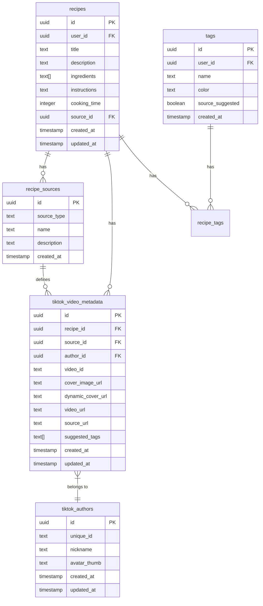
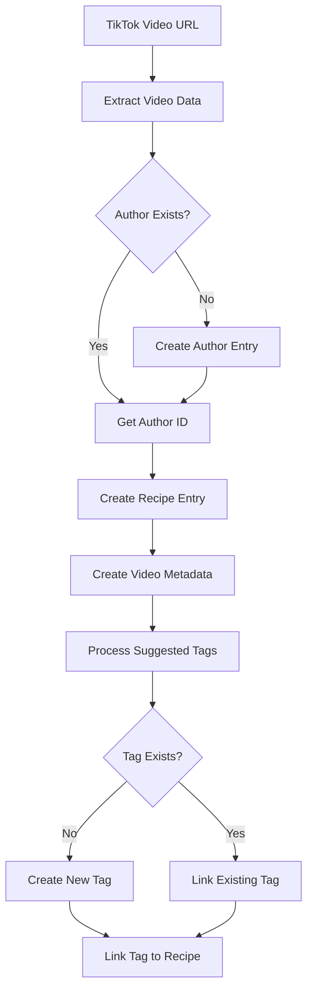

# TikTok Recipe Import - Database Schema Design

## Overview

This document outlines the database schema changes required to support importing recipes from TikTok videos, with extensibility for future social media sources.

## Design Decisions

### 1. **Separate Source Tracking Table**

We'll create a `recipe_sources` table to track different import sources (TikTok, Instagram, YouTube, etc.). This provides:

- Clear separation of concerns
- Easy extensibility for new platforms
- Ability to track source-specific metadata
- Source-level analytics and reporting

### 2. **Normalized Author Data**

We'll create a `tiktok_authors` table to store TikTok author information. This provides:

- Data normalization (avoid duplicate author entries)
- Ability to track all recipes from the same author
- Future features like "follow this author" or "view all recipes from author"
- Author profile updates can be done in one place

### 3. **Separate Video Metadata Table**

We'll create a `tiktok_video_metadata` table to store TikTok-specific video data. This provides:

- Clean separation of platform-specific data
- Easy to extend with additional TikTok fields
- Can be joined when needed without bloating the main recipes table
- Allows for potential video analytics

### 4. **Minimal Changes to Recipes Table**

We'll add only a `source_id` foreign key to the `recipes` table. This keeps:

- The core recipe schema clean and focused
- Backward compatibility with existing recipes
- Simple queries for non-TikTok recipes

### 5. **Reuse Existing Tags System**

We'll store TikTok-suggested tags in the existing `tags` table, with an optional `source_suggested` flag. This provides:

- Consistency across all tag management
- Ability to convert suggested tags to user-created tags
- No need for a separate tag system

## Schema Diagram

## Data Flow

## Migration Strategy

### Phase 1: Add Source Tracking

- Create `recipe_sources` table
- Add `source_id` column to `recipes` table
- Insert default source entries (manual, tiktok)

### Phase 2: Add TikTok-Specific Tables

- Create `tiktok_authors` table
- Create `tiktok_video_metadata` table
- Add indexes for performance

### Phase 3: Update Tags System

- Add `source_suggested` column to `tags` table
- Update RLS policies

### Phase 4: Add Helper Functions

- Create function to import TikTok recipe
- Create function to update author data
- Create function to get recipes by source

## Benefits of This Design

1. **Extensibility**: Easy to add new sources (Instagram, YouTube, etc.)
2. **Normalization**: Author data is stored once, referenced multiple times
3. **Performance**: Proper indexes ensure fast queries
4. **Maintainability**: Clear separation of concerns
5. **Backward Compatibility**: Existing recipes remain unaffected
6. **Data Integrity**: Foreign keys ensure referential integrity
7. **Security**: RLS policies protect user data
8. **Analytics**: Can track recipe sources and author popularity

## Future Enhancements

With this foundation, we can easily add:

- Author following functionality
- Source-specific analytics
- Batch import from multiple videos
- Recipe recommendations based on source
- Author profile pages
- Source filtering in search
